# Jarkom-Modul-4-F06-2023
 
Kelompok F06:
- Arkana Bilal Imani / 5025211034
- 🤓

## Resource

- [Sheet Perhitungan](https://docs.google.com/spreadsheets/d/14c60BSwHFZ9jMbxMC8V4LwsBkQ76Yv2QWYykRAxKQ2Y/edit?usp=sharing)

## Daftar Isi

- [Daftar Isi](#daftar-isi)
- [Soal](#soal)
- [Pembagian Subnet](#pembagian-subnet)
- [VLSM Subnetting](#vlsm-cpt-subnetting)
- [VLSM Routing](#vlsm-cpt-routing)
- [CIDR Subnetting](#cidr-gns3-subnetting)
- [CIDR Routing](#cidr-gns3-routing)
- [Kendala](#kendala)

### Soal


- Soal shift dikerjakan pada Cisco Packet Tracer dan GNS3 menggunakan metode perhitungan CLASSLESS yang berbeda.
Keterangan: Bila di CPT menggunakan VLSM, maka di GNS3 menggunakan CIDR atau sebaliknya
- Jika tidak ada pemberitahuan revisi soal dari asisten, berarti semua soal BERSIFAT BENAR dan DAPAT DIKERJAKAN.
- Untuk di GNS3 CLOUD merupakan NAT1 jangan sampai salah agar bisa terkoneksi internet.
- Pembagian IP menggunakan Prefix IP yang telah ditentukan pada modul pengenalan
- Pembagian IP dan routing harus SE-EFISIEN MUNGKIN.

### Pembagian Subnet 
- [Daftar Isi](#daftar-isi)

Topologi soal dibagi menjadi subnet sebagai berikut:
  
  
Dengan pembagian rute sebagai berikut:  


- Pembagian ini akan digunakan untuk subnetting dan routing metode VLSM dan CIDR.
- Metode pembagian dilakukan dengan melihat urutan switch pada setiap subnet. Maka dari itu kelas A1 sampai A12 adalah subnet yang memiliki host/client dan sisanya adalah subnet diantara subnet subnet tersebut.
- Setelah proses pembagian subnet/kelas ini, bisa dilakukan proses pembagian IP dan NID dengan metode VLSM dan CIDR tadi.

### VLSM-CPT-Subnetting
- [Daftar Isi](#daftar-isi) 

Dengan pembagian kelas A sebagai berikut:
  
  
Dilakukan pembuatan tree pembagian IP berikut:

- Dipilih root tree dengan mask /19 karena jumlah total IP yang dibutuhkan mencapai 4255. Hal ini karena /20 dengan kapasitas 4094 tidak cukup menampung.
- Percabangan tree dilakukan sesuai dengan contoh di modul, dimana cabang yang akan digunakan oleh salah satu kelas A ada di sisi kanan, dan cabang yang akan dicabangkan lagi ada di sisi kiri.
- Tentu saja ada beberapa pengecualian untuk menyesuaikan jumlah IP yang dibutuhkan pada beberapa kelas.  
  
Setelah dilakukan pembagian IP dan NID tersebut, bisa diisikan langsung ke sheet untuk bagian VLSM sebagai berikut:

  
  
- Netmask yang digunakan sudah disesuaikan dari tree juga.
- Broadcast dapat dihitung dengan menambahkan jumlah kemungkinan IP dari netmask ke NID.   
- Contohnya dengan A1; NID = `192.224.0.0`, Netmask = `255.255.255.252`. Dari netmask tersebut diketahui bahwa jumlah kemungkinan IP adalah 4 dikurangi 1 karena 1 digunakan untuk NID-nya sendiri, sama dengan 3. Bilangan 3 tersebut ditambahkan ke NID, menghasilkan `192.224.0.3` yang akan dijadikan IP Broadcast.  
  
Dengan pembagian NID tersebut, bisa dilakukan config subnet dengan beberapa aturan dibawah:
  
- IP Router adalah NID + 1. Contoh pada A1 dengan NID `192.224.0.0`, maka IP router pada subnet tersebut adalah `192.224.0.1`
- Apabila ada 2 router, maka router dengan IP = NID + 1 adalah router yang paling dekat dengan router pusat / Aura.
- IP Client adalah IP router + 1. Contoh pada A1 dengan IP Router `192.224.0.1`, maka IP client pada subnet tersebut adalah `192.224.0.2`
- Apabila ada lebih dari 1 client dalam suatu subnet, maka tinggal menambahkan angka 1 lagi pada IP client pertama tadi. Contohnya jika ada client kedua di A1, IP-nya adalah `192.224.0.2` + 1 = `192.224.0.3` 
- Gateway pada client disesuaikan dengan IP router subnet. Contoh pada client `192.224.0.2`, gateway-nya adalah IP router, `192.224.0.1`
- Router bisa memiliki beberapa IP, disesuaikan dengan subnet apa saja yang terhubung melewati router itu. Pada umumnya 1 router memiliki 2 IP untuk subnet yang memiliki client dan subnet diantara router atau subnet penghubung.

Dilakukan konfigurasi pada 1 subnet, kelas A3, karena selebihnya konfigurasinya harusnya mirip.
  
  
Denken:


  
Pada `0/0`, IP dan Netmask yang digunakan bersumber dari kelas A17 karena sudah beda dengan subnet A3.  
  
Pada `0/1`, IP sudah sesuai dengan aturan diatas dimana IP router adalah NID `(192.224.24.0)` + 1 dengan hasil `192.224.24.1`  
  
Netmask yang digunakan juga sesuai dengan netmask kelas A3 dan A17.  
  
RoyalCapital (63 Host):
  
  
Juga sudah sesuai dengan aturan diatas, dimana IP client adalah IP router + 1. `192.224.24.1` + 1 = `192.224.24.2`

WilleRegion (63 Host):  
  
  
Karena ada lebih dari satu client di subnet ini, maka IP WilleRegion adalah IP RoyalCapital + 1. `192.224.24.2` + 1 = `192.224.24.3`

Apabila sudah diconfig seperti diatas, maka bisa dilakukan ping dalam satu subnet tersebut untuk testing.
  
  
- Konfigurasi ini dilakukan pada setiap subnet, sesuai dengan pembagian NID, Netmask, dan IP Broadcast di [Spreadsheet Pembagian VLSM](https://docs.google.com/spreadsheets/d/14c60BSwHFZ9jMbxMC8V4LwsBkQ76Yv2QWYykRAxKQ2Y/edit?usp=sharing).
- Tentu saja konfigurasi ini belum mencakup connection antar subnet, sehingga masih belum bisa ping antar subnet. Hal tersebut akan dilakukan pada konfigurasi routing.
### VLSM-CPT-Routing
- [Daftar Isi](#daftar-isi)  

Untuk routing, digunakan contoh bagian berikut:  
  
  
Himmel:

  
Pada Himmel, routing yang dilakukan hanya 1, yaitu `0.0.0.0/0` melewati `192.224.0.149`. 
- Hal ini karena Himmel adalah router yang berada di subnet paling ujung (A7). 
- Routing pada subnet paling ujung harus selalu default routing saja. 
- Next hop `192.224.0.149` mengarah ke subnet luar, yaitu IP Flamme di subnet A21.
  
Dengan konfigurasi tersebut client (SchwerMountains) dan router (Himmel) di subnet A7 dapat melakukan ping ke subnet A21. Namun ping ini hanya bisa berjalan satu arah karena routing masih dilakukan di Himmel saja, belum di Flamme/subnet A21.
  
Flamme:
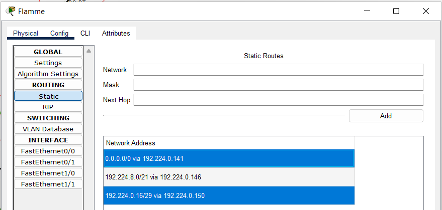
Pada Flamme, routing yang dilakukan adalah `0.0.0.0/0` melewati `192.224.0.141` dan `192.224.0.16/29` melewati `192.224.0.150`.
  
- Karena Flamme adalah router yang  menghubungkan beberapa router sekaligus (Himmel, Fern dan Frieren), terdapat beberapa subnet yang dikenalkan di router ini.
- Flamme juga memiliki default routing, yang mengarah ke IP Frieren (`192.224.0.141`) di subnet A19.
- Untuk mengenalkan subnet A7 ke Flamme, dibuatkan routing yang menggunakan NID dari A7 (`192.224.0.16`) dengan netmask yang sesuai, melalui IP Himmel (`192.224.0.150`) di subnet A21.
  
Dengan konfigurasi tersebut, subnet A21 sudah bisa melakukan ping ke subnet A7. Subnet A7 juga bisa melakukan ping ke arah luar subnet A21, pada kasus ini, A19.  
  
Karena subnet Flamme juga memiliki client (RohrRoad) pada subnet A6, maka subnet ini secara otomatis bisa melakukan ping juga pada subnet A7.

Berikut adalah hasil tes ping routing pada bagian ini:  
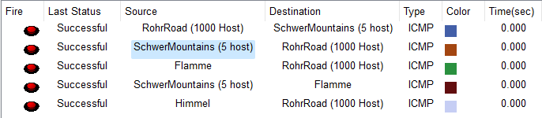
  
Selebihnya, konfigurasi routing antar subnet yang lain harusnya sama, dengan pengenalan setiap subnet yang tidak langsung terhubung di bagian static routing di router.  
  
Berikut adalah hasil tes ping routing VLSM lebih menyeluruh:
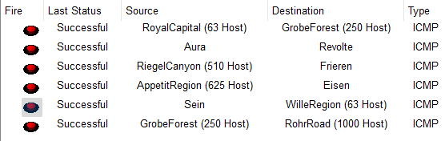

### CIDR-GNS3-Subnetting
- [Daftar Isi](#daftar-isi)  

Untuk pembagian kelas pada CIDR, diperlukan juga penggabungan penggabungan untuk membagikan IP dan NID ke setiap subnet.  
  
Pembagian kelas A (CPT):  


Pembagian kelas A (GNS3):
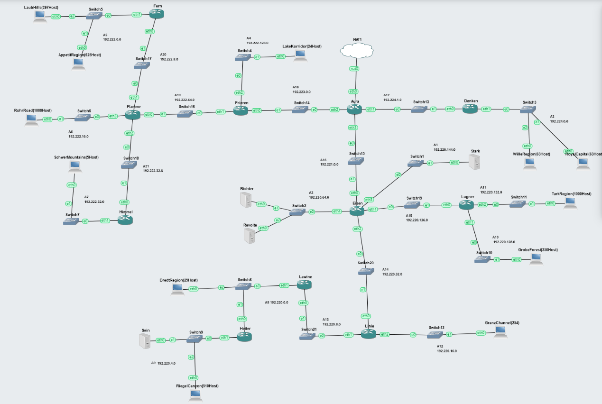
  
Untuk pembagian kelas B, subnet-subnet pada edge yang digabungkan akan digabungkan. Beberapa subnet yang berada di samping (A12, A4, A1, A2, dll) akan diabaikan terlebih dahulu karena harus menunggu subnet-subnet bercabang yang ada dibawahnya untuk digabungkan terlebih dahulu. 

Pembagian kelas B:
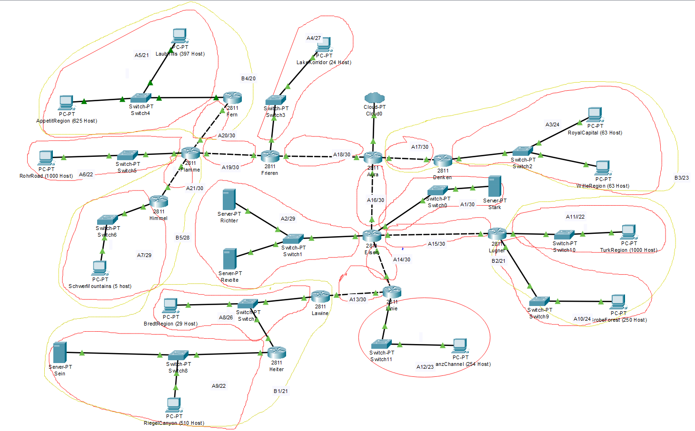
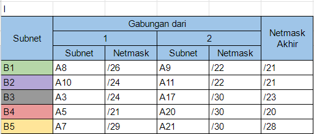
  
Begitu juga dengan kelas C, semua subnet di edge yang akan digabungkan.

Pembagian kelas C:
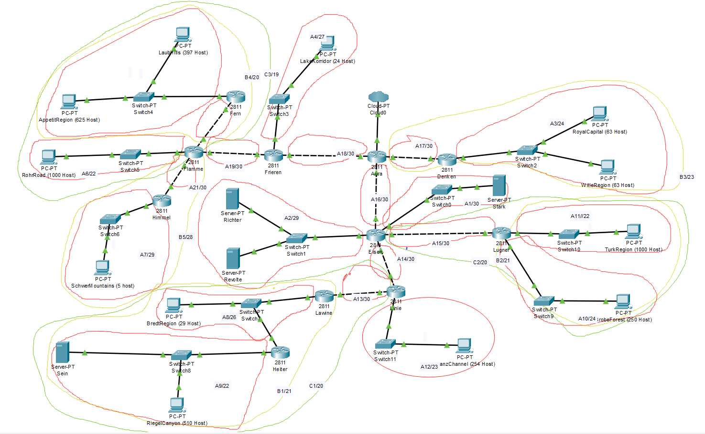
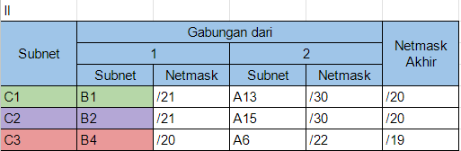
  
Pembagian kelas D:
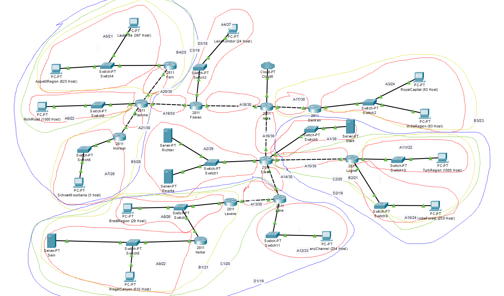
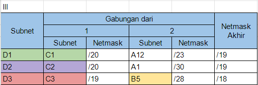
  
Pembagian kelas E:
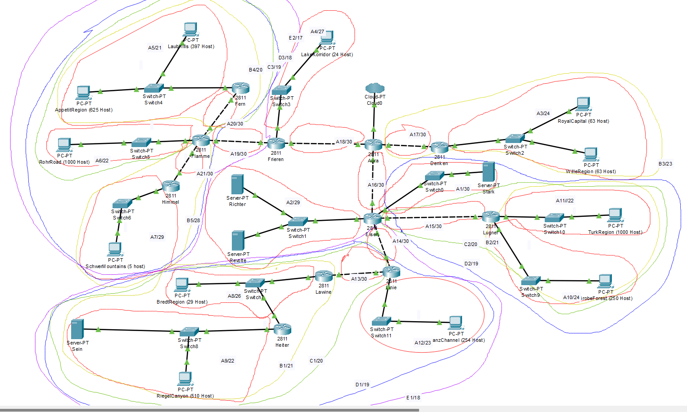
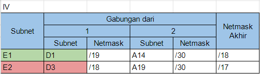
  
Pembagian kelas F:
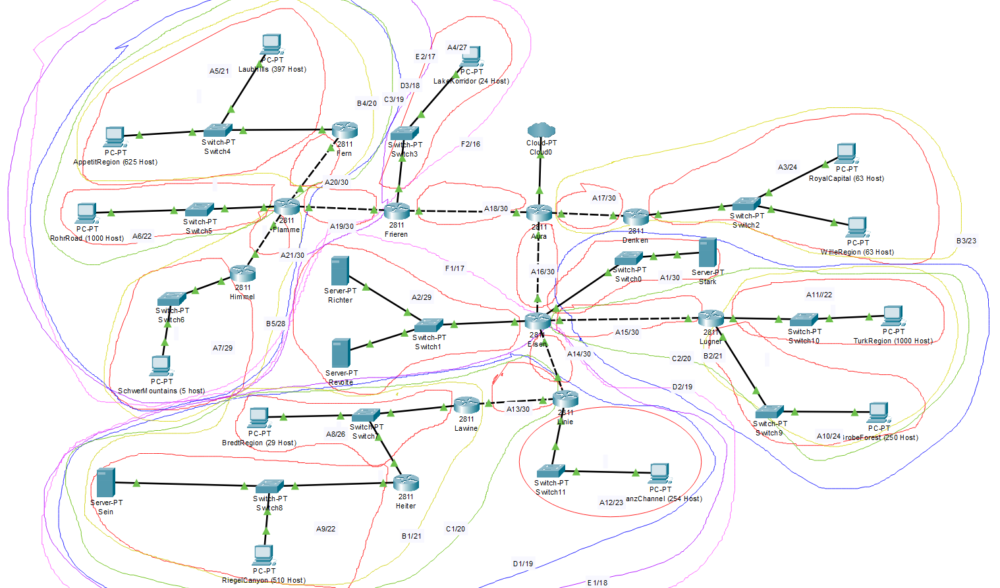
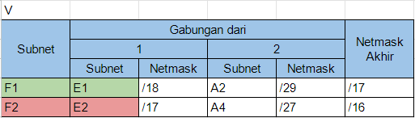
  
Pembagian kelas G:
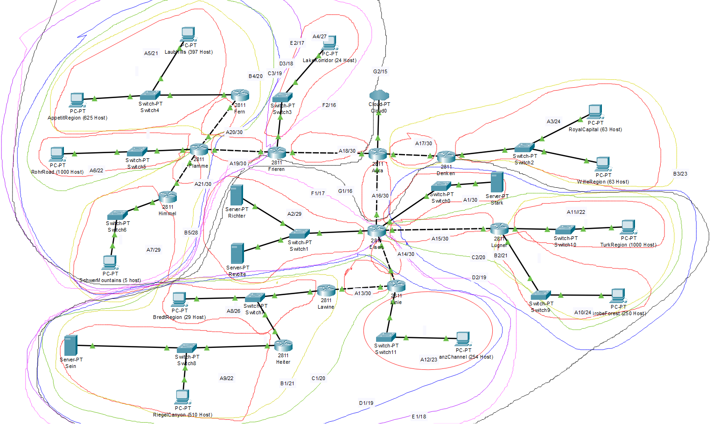
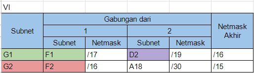
  
Pembagian kelas H:
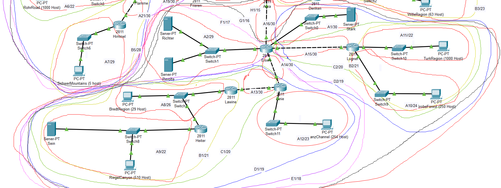
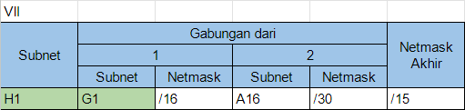

Pembagian kelas I:
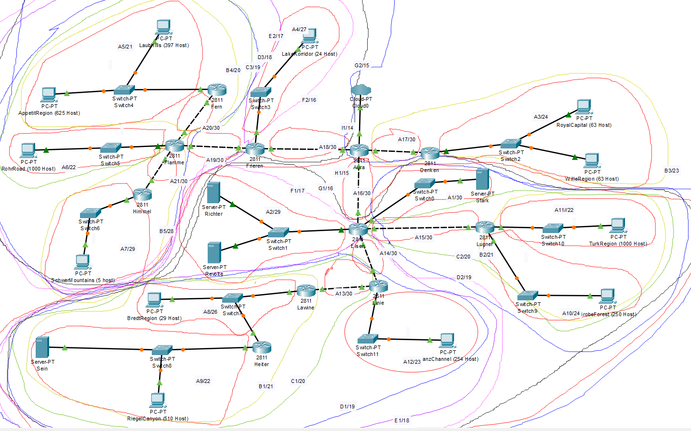
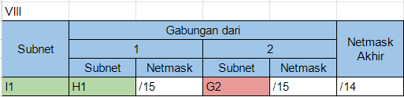

Pembagian kelas J:
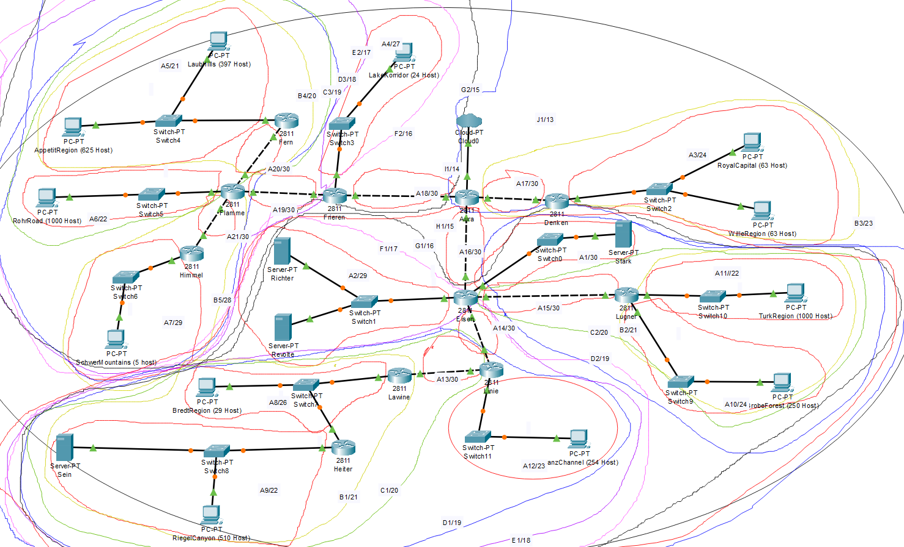
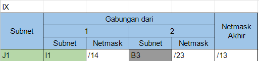

Dengan penggabungan kelas sudah dilakukan, dapat dibuat tree dengan Netmask di root sebesar `/13`.

Tree CIDR:
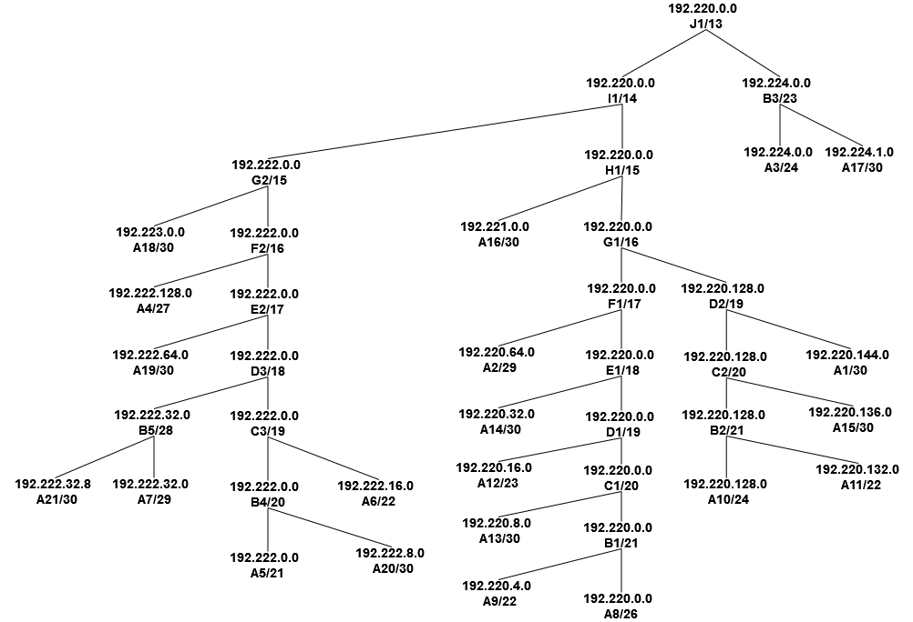

- Aturan percabangan tree CIDR sesuai dengan di modul, dimana percabangan membagi 2 IP sesuai dengan netmask diatasnya.
- Contoh pada `J1/13` dengan cabang `I1/14` dan `B3/23`. walaupun salah satu cabangnya (`B3`) memiliki netmask jauh lebih kecil (`/23`), pembagiannya tetap membagi 2 IP `J1/13` sesuai dengan netmasknya. Dari `192.220.0.0` menjadi `192.220.0.0` dan `192.224.0.0` karena range netmask `/13` adalah `192.220.0` sampai `192.227.0.0`

Dengan tree tersebut bisa dilakukan pembagian IP ke setiap kelas A sebagai berikut:

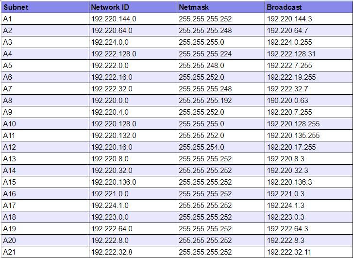

- Karena pembagian kelas A sama dengan pada metode CIDR, semua netmask juga sama.
- NID sudah sesuai dengan hasil tree.
- Perhitungan IP Broadcast juga sama dengan perhitungan pada pembagian subnet VLSM, dimana NID + jumlah kemungkinan IP dari netmask.

Pemberian NID tersebut dalam GNS3 memiliki sedikit perbedaan dengan di CPT. Berikut adalah contoh yang akan digunakan pada kelas A5:

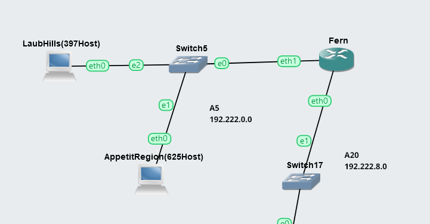

IP address, netmask, dan gateway langsung dimasukkan kedalam network config di router (Fern) dan client (AppetitRegion) seperti berikut:

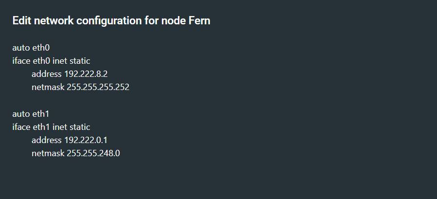
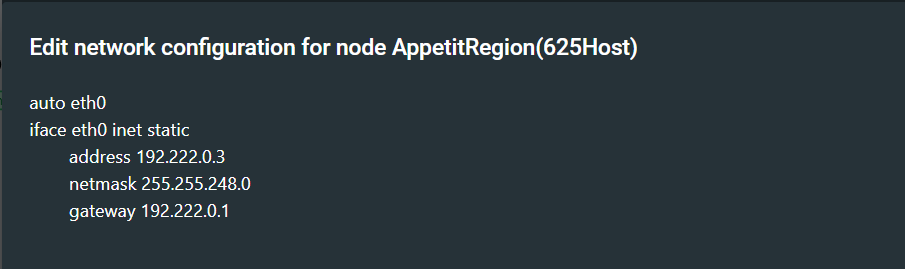

- Bagian `eth0` adalah konfigurasi Fern di subnet A20 yang memiliki IP `192.222.8.2`.
- Bagian `eth1` adalah konfigurasi Fern di subnet A5 yang memiliki IP address dan netmask yang sudah sesuai dengan aturan subnetting VLSM juga. IP address dari Fern adalah NID A5 (`192.222.0.0`) + 1 = `192.222.0.1`
- Fern tidak diberi gateway untuk kedua bagian `eth` karena akan didefine pada saat routing nanti.
- IP address, netmask dan gateway dari client di A5, salah satunya AppetitRegion juga sudah disesuaikan dengan aturan diatas.
- IP address AppetitRegion didapat dengan menambahkan NID dengan 3 karena `192.222.0.1` sudah dipakai untuk router (Fern) dan `192.222.0.2` sudah dipakai client satunya (LaubHills).
- Gateway AppetitRegion sudah disesuaikan dengan IP Fern.

Berikut adalah hasil testing ping dalam satu subnet (A5) tersebut:  

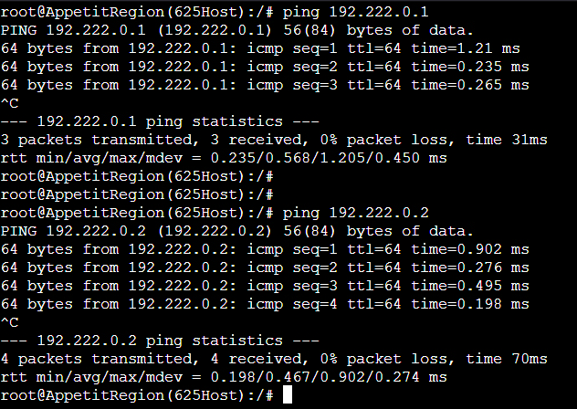

Selebihnya, konfigurasi satu subnet pada subnet-subnet lain harusnya sama, dan hanya membutuhkan mengedit network config saja pada client dan router.

### CIDR-GNS3-Routing
- [Daftar Isi](#daftar-isi)  

Karena CIDR menggunakan GNS3, metode routing sedikit berbeda, menggunakan command `route` di masing masing router.

Diambil contoh pada bagian topologi berikut:

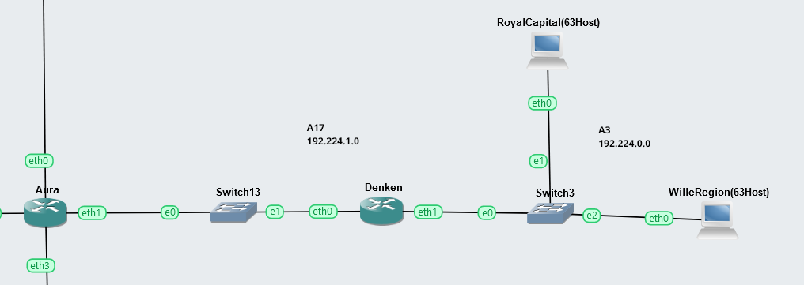

Denken:
```
route add -net 0.0.0.0 netmask 0.0.0.0 gw 192.224.1.1
```
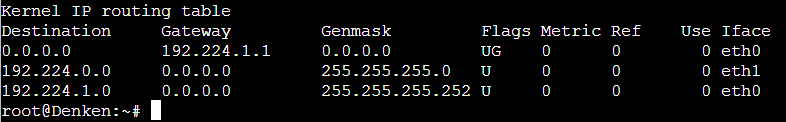

Pada Denken, routing yang dilakukan hanya 1, yaitu `0.0.0.0 `dengan netmask `0.0.0.0` melewati `192.224.1.1`.
- Sama dengan konfigurasi pada VLSM, dilakukan 1 routing saja pada Denken karena Denken adalah router yang berada di subnet paling ujung.
- `192.224.1.1` adalah IP address router yang mengarah ke luar, yaitu IP Aura di subnet A17.

Dengan konfigurasi tersebut, client (RoyalCapital dan WilleRegion) dan router (Denken) di subnet A3 dapat melakukan ping ke subnet A17. Ping ini masih bsia berjalan satu arah saja karena belum dilakukan routing di router Aura/subnet A17.

Aura:
```
route add -net 192.224.0.0 netmask 255.255.255.0 gw 192.224.1.2 #A3
```
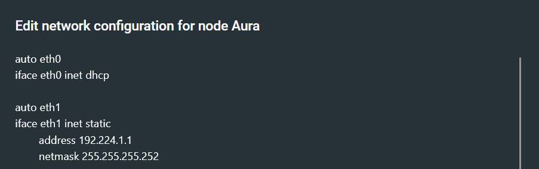

Pada Aura, routing yang dilakukan adalah `192.224.0.0` dengan netmask `255.255.255.0` melalui `192.224.1.2` dan beberapa routing lain diluar konteks contoh.

- Subnet yang dikenalkan ke Aura adalah subnet `192.224.0.0` yang merupakan NID dari kelas A3.
- Netmask yang diberikan juga netmask yang dipakai oleh kelas A3 tersebut.
- Cara Aura bisa mengakses subnet tersebut adalah dengan melalui router Denken dengan IP `192.224.1.2` melalui koneksi `eth1` yang sudah didefinisikan di network config Aura seperti diatas.

Dengan konfigurasi tersebut, subnet A17 sudah bisa melakukan ping ke subnet A3 dan sebaliknya.

Berikut adalah hasil tes ping routing pada bagian ini:
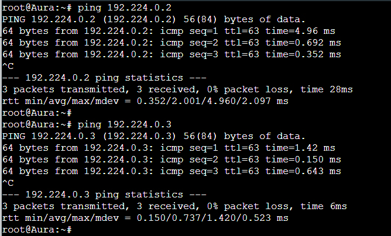
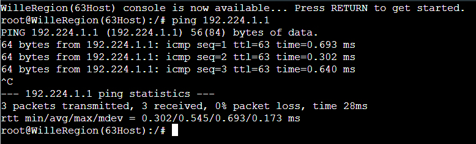

Selebihnya, konfigurasi routing antar subnet yang lain harusnya sama, dengan pengenalan setiap subnet yang tidak langsung terhubung dengan menggunakan command `route add` tersebut.

Karena Aura adalah router pusat, maka Aura adalah router dengan konfigurasi routing terbanyak karena harus mengenal semua subnet pada topologi ini.

Berikut adalah konfigurasi routing aura:
```
route add -net 192.220.0.0 netmask 255.255.255.192 gw 192.221.0.2 #A8
route add -net 192.220.4.0 netmask 255.255.252.0 gw 192.221.0.2 #A9
route add -net 192.220.8.0 netmask 255.255.255.252 gw 192.221.0.2 #A13
route add -net 192.220.16.0 netmask 255.255.254.0 gw 192.221.0.2 #A12

route add -net 192.220.128.0 netmask 255.255.255.0 gw 192.221.0.2 #A10
route add -net 192.220.132.0 netmask 255.255.252.0 gw 192.221.0.2 #A11

route add -net 192.220.144.0 netmask 255.255.255.252 gw 192.221.0.2 #A1
route add -net 192.220.64.0 netmask 255.255.255.248 gw 192.221.0.2 #A2

route add -net 192.224.0.0 netmask 255.255.255.0 gw 192.224.1.2 #A3

route add -net 192.222.0.0 netmask 255.255.248.0 gw 192.223.0.2 #A5
route add -net 192.222.32.0 netmask 255.255.255.248 gw 192.223.0.2 #A7
route add -net 192.222.16.0 netmask 255.255.252.0 gw 192.223.0.2 #A6

route add -net 192.222.8.0 netmask 255.255.255.252 gw 192.223.0.2 #A20
route add -net 192.222.32.8 netmask 255.255.255.252 gw 192.223.0.2 #A21

route add -net 192.222.64.0 netmask 255.255.255.252 gw 192.223.0.2 #A19
```

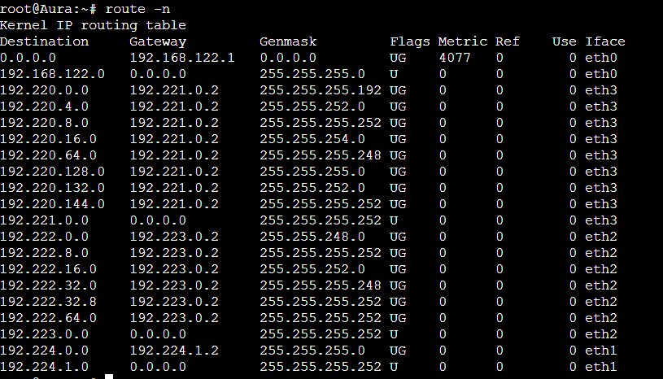


Semua gateway tersebut juga sudah sesuai dengan network config Aura sebagai berikut:

```
auto eth0
iface eth0 inet dhcp

auto eth1
iface eth1 inet static
	address 192.224.1.1
	netmask 255.255.255.252

auto eth2
iface eth2 inet static
	address 192.223.0.1
	netmask 255.255.255.252

auto eth3
iface eth3 inet static
	address 192.221.0.1
	netmask 255.255.255.252
```
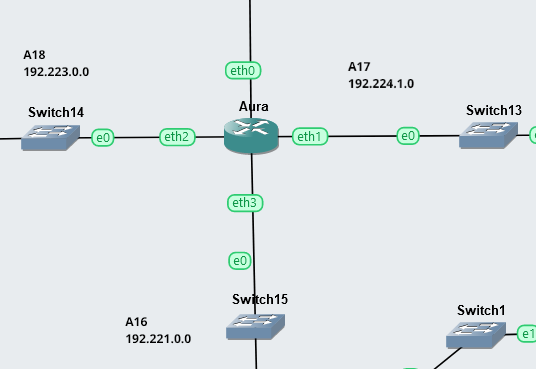

Berikut adalah testing ping lebih menyeluruh di CIDR-GNS3:

- WilleRegion to ScwherMountains:
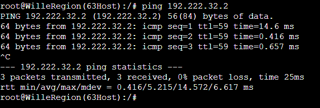
- RiegelCanyon to Lugner:
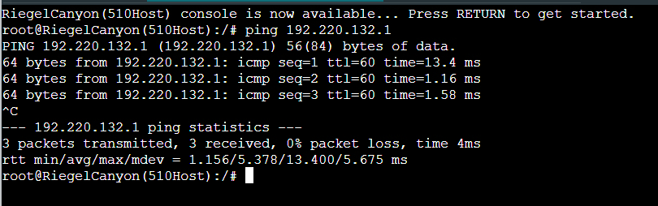
- Flamme to GranzChannel:
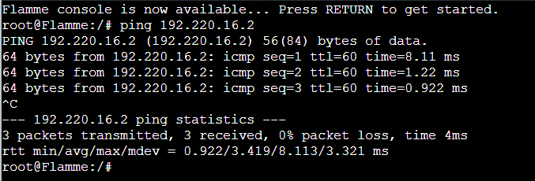

### Kendala

Sangat aman.


