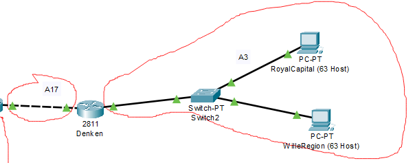
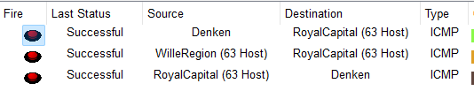

# Jarkom-Modul-4-F06-2023
 
Kelompok F06:
- Arkana Bilal Imani / 5025211034
- 

## Resource

- [Sheet Perhitungan](https://docs.google.com/spreadsheets/d/14c60BSwHFZ9jMbxMC8V4LwsBkQ76Yv2QWYykRAxKQ2Y/edit?usp=sharing)

## Daftar Isi

- [Daftar Isi](#daftar-isi)
- [Soal](#soal)
- [Pembagian Subnet](#pembagian-subnet)
- [VLSM Subnetting](#vlsm-cpt-subnetting)
- [VLSM Routing](#vlsm-cpt-routing)

### Soal

- Soal shift dikerjakan pada Cisco Packet Tracer dan GNS3 menggunakan metode perhitungan CLASSLESS yang berbeda.
Keterangan: Bila di CPT menggunakan VLSM, maka di GNS3 menggunakan CIDR atau sebaliknya
- Jika tidak ada pemberitahuan revisi soal dari asisten, berarti semua soal BERSIFAT BENAR dan DAPAT DIKERJAKAN.
- Untuk di GNS3 CLOUD merupakan NAT1 jangan sampai salah agar bisa terkoneksi internet.
- Pembagian IP menggunakan Prefix IP yang telah ditentukan pada modul pengenalan
- Pembagian IP dan routing harus SE-EFISIEN MUNGKIN.

### Pembagian Subnet 
- [Daftar Isi](#daftar-isi)

Topologi soal dibagi menjadi subnet sebagai berikut:
  
  
Dengan pembagian rute sebagai berikut:  

- Pembagian ini akan digunakan untuk subnetting dan routing metode VLSM dan CIDR.
- Metode pembagian dilakukan dengan melihat urutan switch pada setiap subnet. Maka dari itu kelas A1 sampai A12 adalah subnet yang memiliki host/client dan sisanya adalah subnet diantara subnet subnet tersebut.
- Setelah proses pembagian subnet/kelas ini, bisa dilakukan proses pembagian IP dan NID dengan metode VLSM dan CIDR tadi.

### VLSM-CPT-Subnetting
- [Daftar Isi](#daftar-isi) 

Dengan pembagian kelas A sebagai berikut:
  
  
Dilakukan pembuatan tree pembagian IP berikut:

- Dipilih root tree dengan mask /19 karena jumlah total IP yang dibutuhkan mencapai 4255. Hal ini karena /20 dengan kapasitas 4094 tidak cukup menampung.
- Percabangan tree dilakukan sesuai dengan contoh di modul, dimana cabang yang akan digunakan oleh salah satu kelas A ada di sisi kanan, dan cabang yang akan dicabangkan lagi ada di sisi kiri.
- Tentu saja ada beberapa pengecualian untuk menyesuaikan jumlah IP yang dibutuhkan pada beberapa kelas.  
  
Setelah dilakukan pembagian IP dan NID tersebut, bisa diisikan langsung ke sheet untuk bagian VLSM sebagai berikut:

  
  
- Netmask yang digunakan sudah disesuaikan dari tree juga.
- Broadcast dapat dihitung dengan menambahkan jumlah kemungkinan IP dari netmask ke NID.   
- Contohnya dengan A1; NID = `192.224.0.0`, Netmask = `255.255.255.252`. Dari netmask tersebut diketahui bahwa jumlah kemungkinan IP adalah 4 dikurangi 1 karena 1 digunakan untuk NID-nya sendiri, sama dengan 3. Bilangan 3 tersebut ditambahkan ke NID, menghasilkan `192.224.0.3` yang akan dijadikan IP Broadcast.  
  
Dengan pembagian NID tersebut, bisa dilakukan config subnet dengan beberapa aturan dibawah:
  
- IP Router adalah NID + 1. Contoh pada A1 dengan NID `192.224.0.0`, maka IP router pada subnet tersebut adalah `192.224.0.1`
- Apabila ada 2 router, maka router dengan IP = NID + 1 adalah router yang paling dekat dengan router pusat / Aura.
- IP Client adalah IP router + 1. Contoh pada A1 dengan IP Router `192.224.0.1`, maka IP client pada subnet tersebut adalah `192.224.0.2`
- Apabila ada lebih dari 1 client dalam suatu subnet, maka tinggal menambahkan angka 1 lagi pada IP client pertama tadi. Contohnya jika ada client kedua di A1, IP-nya adalah `192.224.0.2` + 1 = `192.224.0.3` 
- Gateway pada client disesuaikan dengan IP router subnet. Contoh pada client `192.224.0.2`, gateway-nya adalah IP router, `192.224.0.1`
- Router bisa memiliki beberapa IP, disesuaikan dengan subnet apa saja yang terhubung melewati router itu. Pada umumnya 1 router memiliki 2 IP untuk subnet yang memiliki client dan subnet diantara router atau subnet penghubung.

Dilakukan konfigurasi pada 1 subnet, kelas A3, karena selebihnya konfigurasinya harusnya mirip.
  
  
Denken:

  
Pada `0/0`, IP dan Netmask yang digunakan bersumber dari kelas A17 karena sudah beda dengan subnet A3.  
  
Pada `0/1`, IP sudah sesuai dengan aturan diatas dimana IP router adalah NID `(192.224.24.0)` + 1 dengan hasil `192.224.24.1`  
  
Netmask yang digunakan juga sesuai dengan netmask kelas A3 dan A17.  
  
RoyalCapital (63 Host):
  
  
Juga sudah sesuai dengan aturan diatas, dimana IP client adalah IP router + 1. `192.224.24.1` + 1 = `192.224.24.2`

WilleRegion (63 Host):  
  
  
Karena ada lebih dari satu client di subnet ini, maka IP WilleRegion adalah IP RoyalCapital + 1. `192.224.24.2` + 1 = `192.224.24.3`

Apabila sudah diconfig seperti diatas, maka bisa dilakukan ping dalam satu subnet tersebut untuk testing.
  
  
- Konfigurasi ini dilakukan pada setiap subnet, sesuai dengan pembagian NID, Netmask, dan IP Broadcast di [Spreadsheet Pembagian VLSM](https://docs.google.com/spreadsheets/d/14c60BSwHFZ9jMbxMC8V4LwsBkQ76Yv2QWYykRAxKQ2Y/edit?usp=sharing).
- Tentu saja konfigurasi ini belum mencakup connection antar subnet, sehingga masih belum bisa ping antar subnet. Hal tersebut akan dilakukan pada konfigurasi routing.
### VLSM-CPT-Routing
- [Daftar Isi](#daftar-isi)  

Untuk routing, digunakan contoh bagian berikut:  
  
  
Himmel:

  
Pada Himmel, routing yang dilakukan adalah `0.0.0.0/0` melewati `192.224.0.149`.

